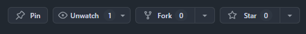

# Monolith Loading Screen
This repository is the Monolith Loading Screen; this is what you'll see when loading into Monolith Servers, if you wish to contribute to the loading-screen by providing images, tips or help make improvements to the loading-screen; read the "**Contributing**" section below. 

# Contributing
We welcome and appreciate all contributions to the Monolith Loading Screen project. Whether you're submitting new images, optimizing performance, writing helpful loading tips, or improving the user experience—your input helps us create a more engaging and polished experience for the Monolith Servers community.

### Ways to Contribute
- **Images**: Submit high-quality, thematically appropriate images that represent Monolith Servers. Images should be in .jpg or .png format and adhere to community standards.

- **Loading Tips**: Provide useful and concise gameplay or server-related tips that will assist new and veteran players during the loading process.

- **Code Improvements**: Suggestions or pull requests that improve the frontend experience, responsiveness, or general performance are encouraged.

- **Bug Reports**: If you notice a bug or issue in the loading screen, please create a GitHub Issue with a clear description and, if possible, steps to reproduce the problem.

## Contribution Instructions
- **Fork** this Github Repository by clicking the Fork button on the top-right of the page, it'll look like this 

- If you're contributing to images, just make the image you'd like to contribute to the loading screen, then once finished, put that image inside the **images** folder, then edit the **images.json** file and add a new line with your image file and your name in this format:
```json
    { "fileName": "image_name.png", "author": "Your Name" }
```

- If you're contributing to tips, all you gotta do is modify the **tips.json** file, create a new line and add the tip you'd like to add to the loading-screen, ensure the tip isn't long and is a short one-line sentence.

- If you're contributing to any other aspect of the project, feel free to make your suggested changes to the loading-screen, you'll need to know how to work with JavaScript, HTML and CSS.

- Once you've finished making your contribution, all you need to do is **commit** your changes to your fork that you've made, then on your repository’s page, click a button that says "**Contribute**" then click "**Open a pull request."** and that's it! 

- A editor of the project will review your contributions and respond back to your pull-request, ensure to keep an eye on it. 

### Links you might find useful
- [Contributing to a project](https://docs.github.com/en/get-started/exploring-projects-on-github/contributing-to-a-project)
- [Visual Studio Code](https://code.visualstudio.com/)
- [Using Git source control in VS Code](https://code.visualstudio.com/docs/sourcecontrol/overview)

# 📢 Media Contribution Disclaimer
By contributing media assets (including but not limited to images, videos, sound clips, or other visual/audio materials) to this repository:

- ### Ownership Assurance: 
  You affirm that:

  - You are the original creator of the submitted content, or

  - You hold exclusive rights to redistribute the content under applicable laws and licenses.

- ### License to Monolith Servers:
  By submitting your content to this repository, you grant the repository owners and affiliated parties, including Monolith Servers and Thriving Ventures AB, a non-exclusive, perpetual, worldwide, royalty-free license to use, reproduce, display, distribute, and incorporate the material into any of their services, including the Monolith game servers and web platforms.

- ### No Compensation:
   You acknowledge that this license is granted free of charge and that you will not receive monetary compensation or other benefits for the use of your submitted content.

- ### Responsibility:
   The repository owners, maintainers, and Monolith Servers assume no responsibility for any legal issues that may arise from the media you submit.
   
   **You**, the **contributor**, agree to be fully responsible for:

  - Ensuring the material does not infringe on any third-party rights.

  - Responding to any claims of copyright infringement.

  - Accepting liability for any disputes arising from your contribution.

 - ### Removal Requests:
   If you believe a contributed media asset infringes upon your copyright or rights, please contact the repository owner directly:

   Repository Owners:
   - [Jetaime Alexandria](https://github.com/Jetaime-Alexandria) (**Discord:** Jet0751) (**Email:** Jetfrommonolith@gmail.com)